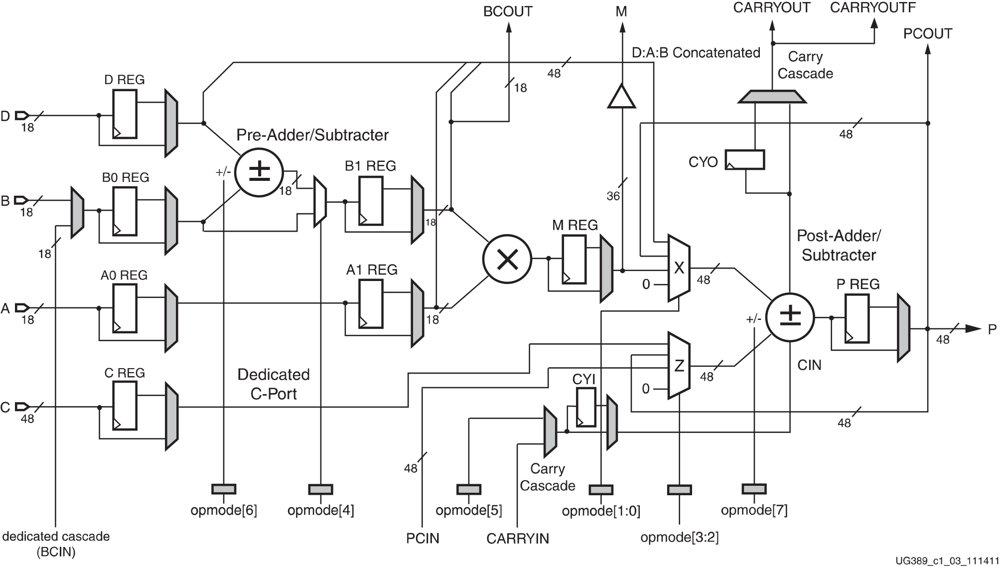

# DSP48A1 Block RTL Design

This repository contains the RTL design, verification environment, and documentation for the DSP48A1 Block implemented using Verilog.

## Architecture


## Repository Structure

```
│   DSP.xdc                                                                                                                                                                         
│                                                                                                                                                                                   
├───Documentation                                                                                                                                                                   
│       Documentation.docx                                                                                                                                                          
│       Documentation.pdf                                                                                                                                                           
│                                                                                                                                                                                   
├───RTL                                                                                                                                                                             
│       DSP48A1.v                                                                                                                                                                   
│       registered.v                                                                                                                                                                
│                                                                                                                                                                                   
└───Verification                                                                                                                                                                    
        DSP48A1_tb.v                                                                                                                                                                
        run_DSP48A1.do                                                                                                                                                              
        src_files.list
```

## Overview

The DSP48A1 block is a highly configurable DSP block used in various digital signal processing applications. This project includes the RTL design of the DSP48A1 block, along with the necessary verification files to test its functionality.

## Files Description

### RTL
- `DSP48A1.v`: The main Verilog module for the DSP48A1 block.
- `registered.v`: A helper module used for registered inputs and outputs.

### Verification
- `DSP48A1_tb.v`: The testbench for verifying the functionality of the DSP48A1 block.
- `run_DSP48A1.do`: The script to run the simulation.
- `src_files.list`: A list of source files required for the simulation.

### Documentation
- `Documentation.docx`: Detailed documentation of the DSP48A1 block design and implementation.
- `Documentation.pdf`: PDF version of the detailed documentation.

## DSP48A1 Module

The DSP48A1 block is designed with various configurable parameters and handles multiple operations, including addition, subtraction, and multiplication. It also supports various pipeline stages for inputs and outputs.

### Parameters
- `A0REG`, `A1REG`, `B0REG`, `B1REG`: Registers for input operands.
- `CREG`, `DREG`, `MREG`, `PREG`: Registers for intermediate and final results.
- `CARRYINREG`, `CARRYOUTREG`, `OPMODEREG`: Registers for control signals.
- `CARRYINSEL`, `B_INPUT`, `RSTTYPE`: Configuration options for carry-in selection, B input source, and reset type.

### Ports
- **Inputs**:
  - `A`, `B`, `D`: 18-bit input operands.
  - `C`: 48-bit input operand.
  - `OPMODE`: 8-bit operation mode.
  - `BCIN`, `PCIN`: Cascade inputs.
  - `CLK`: Clock signal.
  - `CARRYIN`: Carry-in input.
  - `RSTA`, `RSTB`, `RSTC`, `RSTCARRYIN`, `RSTD`, `RSTM`, `RSTOPMODE`, `RSTP`: Reset signals.
  - `CEA`, `CEB`, `CEC`, `CECARRYIN`, `CED`, `CEM`, `CEOPMODE`, `CEP`: Clock enable signals.

- **Outputs**:
  - `BCOUT`: 18-bit cascade output.
  - `PCOUT`: 48-bit cascade output.
  - `P`: 48-bit final result.
  - `M`: 36-bit intermediate result.
  - `CARRYOUT`, `CARRYOUTF`: Carry-out signals.

## Usage

1. **RTL Simulation**: Use the provided testbench `DSP48A1_tb.v` and the script `run_DSP48A1.do` to run simulations and verify the functionality of the DSP48A1 block.
2. **Synthesis**: Use `DSP.xdc` for synthesis constraints.

## Documentation

Detailed documentation is provided in the `Documentation` folder. Refer to `Documentation.docx` or `Documentation.pdf` for a comprehensive explanation of the design, its features, and usage instructions.

## License

This project is licensed under the MIT License. See the LICENSE file for more details.

## Acknowledgments

Special thanks to [Your Name/Institution] for their support and contributions to this project.

For any queries or contributions, please contact [Your Contact Information].

---

Feel free to reach out if you have any questions or need further assistance. Happy coding!
